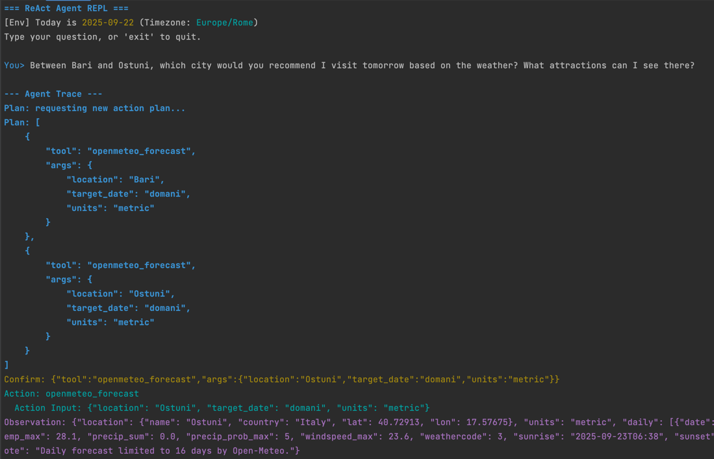
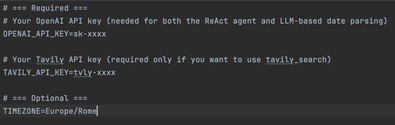

# 🧩 Agentic Systems for Dummies
## Within ReAct!

This repository is part of the series **“Agentic Systems for Dummies”**, where we explore the fundamentals of AI agents with practical, beginner-friendly examples.  

Here we demonstrate the **ReAct pattern** (Reasoning + Acting), a paradigm where an AI agent not only generates text but also **reasons explicitly** and **takes actions** using external tools.  

Think of it as giving your AI a brain (reasoning) and hands (actions) — so it can solve problems step by step, not just answer in one shot.

---

## ✨ What this Agent Does
- **Thinks step by step**  
  The agent produces a reasoning trace (like its inner thoughts) before deciding what to do next.  

- **Chooses and uses tools**  
  It can call external APIs and functions, such as:
  - 🔍 **Web search** (via Tavily)  
  - 🌦️ **Weather forecasts**  
  - 🗂️ Other custom tools you can add  

- **Interleaves reasoning and acting**  
  It reasons → acts → observes results → reasons again, until it finds the best answer.  

- **Explains its process**  
  The CLI shows the agent trace in real time, so you can watch the reasoning unfold step by step.  

- **Extensible by design**  
  You can add your own tools (APIs, services, functions) and the agent will use them when needed.  

- **Educational**  
  This project is written to be **easy to read and hack**. Perfect for students, professionals, or anyone curious about how AI agents really work.

---

## 📂 Project Structure
```
.
├── src/
│   ├── agent.py        # Core agent logic: reasoning loop + tool selection
│   ├── prompts.py      # Centralized prompts used by the agent
│   ├── schemas.py      # Pydantic models & validation for structured data
│   ├── tools.py        # Tools available to the agent (weather, search, etc.)
│   └── terminal.py     # CLI interface with colored output and agent trace
├── .env.example        # Example environment variables
└── requirements.txt    # Python dependencies
```

---

## ⚙️ Installation
1. Clone the repository:
   ```bash
   git clone https://github.com/MattiaMellone/Agentic-Systems-for-Dummies---Within-ReAct
   cd Agentic-Systems-for-Dummies---Within-ReAct
   ```

2. Create and activate a virtual environment:
   ```bash
   python -m venv venv
   source venv/bin/activate   # macOS/Linux
   venv\Scripts\activate      # Windows
   ```

3. Install dependencies:
   ```bash
   pip install -r requirements.txt
   ```

4. Copy the environment file:
   ```bash
   cp .env.example .env
   ```
   Fill in your OpenAI API key and Tavily API key inside `.env`.

---

## 🚀 Usage
Run the interactive terminal:
```bash
python -m src.terminal
```

Example interaction:
```plaintext
> What will the weather be in Bari tomorrow?

--- Agent Trace ---
Plan: call the weather tool for Bari, tomorrow
Observation: "Tomorrow in Bari: 26°C, sunny."
Reasoning: With this observation, I can answer the question.
Final Answer: "It will be sunny in Bari tomorrow, with around 26°C."
```

You will see:
- The **question you ask**  
- The **agent’s reasoning steps**  
- The **tools it calls and their results**  
- The **final answer**  

---

## 🖼️ Screenshots

<p align="center">
  
</p>

<p align="center">
  
</p>

---

## 🛠️ How to Extend the Agent
One of the key strengths of this project is **extensibility**.  
You can easily plug in your own tools:

1. Add a new function in `tools.py`  
2. Define its schema in `schemas.py`  
3. Reference it in the agent’s toolset  

Example: Adding an **Events API**
- Write a function that calls an events API  
- Add its schema (inputs/outputs)  
- Now the agent can automatically decide:  
  *“If the user asks about what to do tomorrow, first check the weather. If sunny, call the Events API.”*

This way, the agent becomes a **decision-maker**, not just a chatbot.

---

## 🎓 Why This Matters
Most chatbots generate answers directly.  
But **ReAct agents**:
- Can break down complex tasks  
- Use external knowledge and APIs  
- Adapt dynamically to different situations  
- Provide transparency through their reasoning trace  

This is the foundation of **modern AI systems** like autonomous assistants, copilots, and orchestration frameworks.

---

## 📜 License
This project is released under the **MIT License** – free to use, modify, and share.

---
